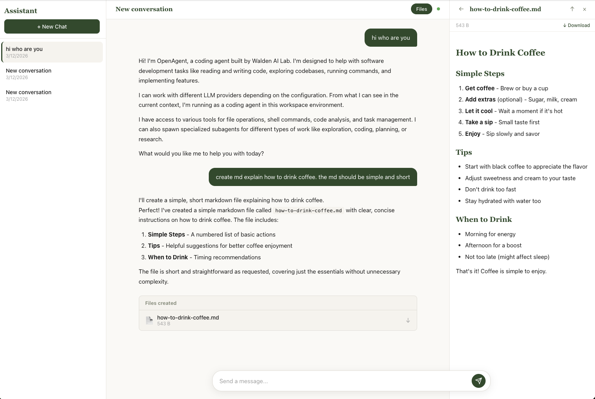
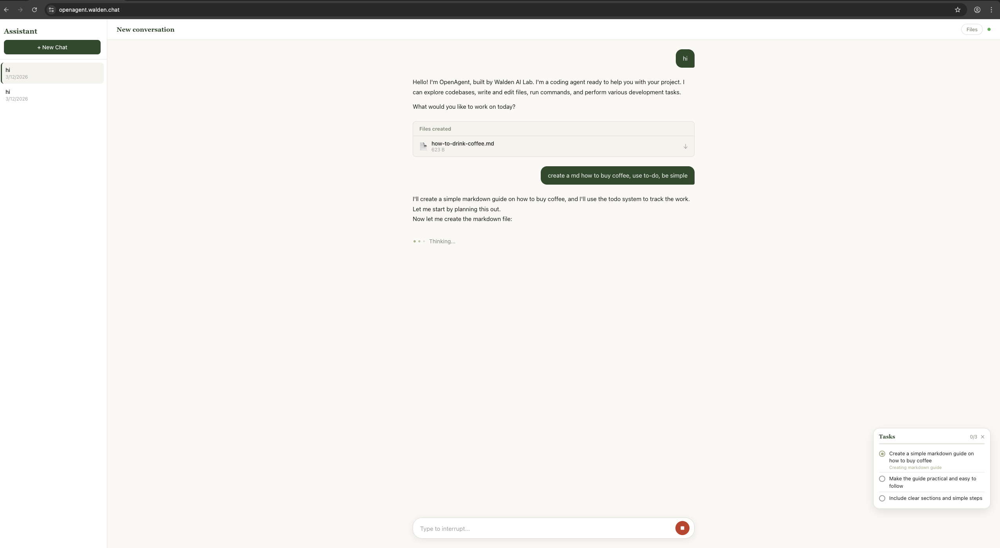
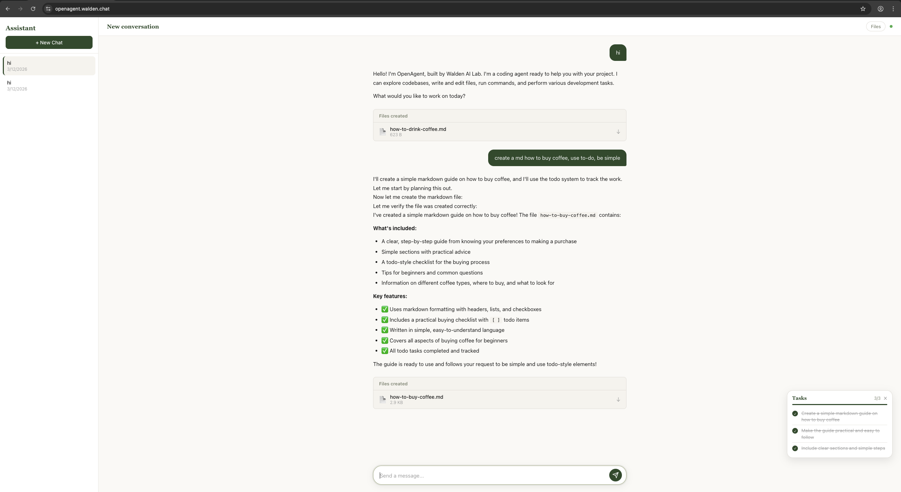
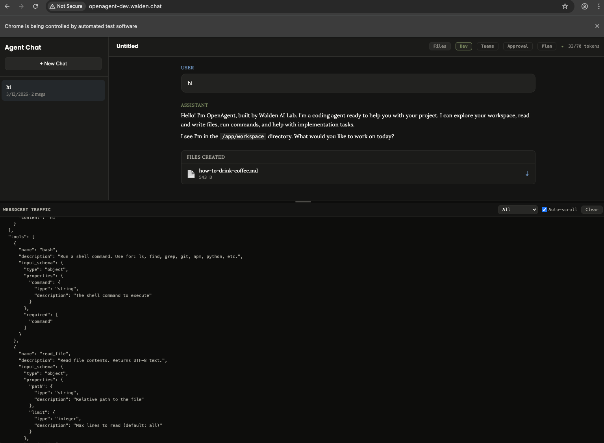

<p align="center">
  <h1 align="center">OpenAgent</h1>
  <p align="center">
    A beginner-friendly, source-available AI coding agent for learning how agents work by building and running one yourself.
  </p>
  <p align="center">
    <a href="#quick-start">Quick Start</a> &bull;
    <a href="#features">Features</a> &bull;
    <a href="#architecture">Architecture</a> &bull;
    <a href="#testing">Testing</a> &bull;
    <a href="#documentation">Docs</a> &bull;
    <a href="#contributing">Contributing</a>
  </p>
  <p align="center">
    <strong>Translations:</strong>&nbsp;
    <a href="docs/README_zh.md">中文</a> &bull;
    <a href="docs/README_ja.md">日本語</a> &bull;
    <a href="docs/README_ko.md">한국어</a> &bull;
    <a href="docs/README_es.md">Español</a> &bull;
    <a href="docs/README_fr.md">Français</a>
  </p>
</p>

---

## What Is This?

OpenAgent is a beginner-first AI coding agent project for people who are curious how modern agents work. You can **run it locally**, **read every line of it**, and **learn by changing real code instead of studying abstract diagrams**.

You type a message like *"Create a REST API with authentication"*, and the agent:

1. Reads your codebase to understand the context
2. Plans an approach (optionally in read-only plan mode)
3. Writes code, runs commands, creates files using tools
4. Verifies its own work before finishing
5. Reports back with results — all streamed in real time

```
You: "Add user authentication with JWT tokens"

Agent: [thinking] Let me explore the codebase first...
       [read_file] src/app.py — found the Flask app
       [read_file] requirements.txt — no auth libraries yet
       [bash] pip install PyJWT bcrypt
       [write_file] src/auth.py — JWT token generation
       [edit_file] src/app.py — added login/register routes
       [bash] python -m pytest tests/ — all 12 tests pass

       Done! I've added JWT authentication with login and
       register endpoints. Here's what I created: ...
```

## Live Deployments
*(Available before March 20, 2026)*

- User UI: [https://openagent.walden.chat](https://openagent.walden.chat)
- Developer UI: [https://openagent-dev.walden.chat](https://openagent-dev.walden.chat)


## Screenshots

**User UI**







**Developer UI**



## Repository Scope

This monorepo contains the OpenAgent runtime stack and the repo-governance files needed
to publish and maintain it as a source-available project.

- Runtime projects: `agent-api/`, `agent-cli/`, `agent-ui/`, `agent-user-ui/`, `agent-ui-cn/`, `agent-user-ui-cn/`
- Repo operations: `.github/`, `docs/`, `README.md`, `CONTRIBUTING.md`, `LICENSE`,
  `SECURITY.md`, `CODE_OF_CONDUCT.md`

## Why This Project?

Most AI agent projects are either too abstract for beginners or too closed to learn from properly. OpenAgent is:

- **Readable** — the core loop is ~30 lines. No frameworks, no magic.
- **Educational** — built for beginners who want to learn agent architecture by running it, tracing it, and changing it.
- **Complete** — web UI, terminal CLI, streaming, tools, memory, teams, plan mode.
- **Documented** — includes contributor guidance, security policy, translations, and component-level technical references.
- **LLM-independent** — the core loop targets a shared `LLMClient` interface instead of a single model vendor.
- **Extensible** — add a new tool in 20 lines. Add or swap provider adapters without rewriting the loop.

## Quick Start

### Prerequisites

- Python 3.11+ (3.14 recommended)
- Credentials for your chosen LLM provider or compatible endpoint

### Published Packages

OpenAgent is also published on PyPI:

- [`openagent-core`](https://pypi.org/project/openagent-core/) — backend library
- [`openagent-app`](https://pypi.org/project/openagent-app/) — terminal CLI

If you only want the packaged CLI instead of a monorepo checkout:

```bash
pip install openagent-app
openagent
```

### Option 1a: Developer Web UI

```bash
# Clone your fork or local copy
git clone <your-fork-or-local-copy>
cd openagent

# Backend
cd agent-api
python -m venv .venv && source .venv/bin/activate
pip install -e .
cat > .env <<'EOF'
LLM_PROVIDER=anthropic
ANTHROPIC_API_KEY=your-key-here
EOF
uvicorn agent_service.main:app --reload

# Developer Frontend (new terminal)
cd /path/to/openagent/agent-ui
python3 -m http.server 3500

# Open http://localhost:3500
```

### Option 1b: User Web UI

```bash
# Same backend as above, then in a new terminal:
cd /path/to/openagent/agent-user-ui
python3 -m http.server 3501

# Open http://localhost:3501
```

The User UI is a lighter, user-facing interface with a Forest Canopy light theme, activity indicators instead of raw tool blocks, and simplified approval dialogs. Both UIs connect to the same backend.

### Option 1c: Chinese Web UIs

Chinese-translated versions of both frontends are available:

```bash
# Chinese Developer UI
cd /path/to/openagent/agent-ui-cn
python3 -m http.server 3502
# Open http://localhost:3502

# Chinese User UI
cd /path/to/openagent/agent-user-ui-cn
python3 -m http.server 3503
# Open http://localhost:3503
```

These are fully localized copies with all user-facing strings translated to Simplified Chinese and fonts updated to include Noto Sans SC. They connect to the same backend as their English counterparts.

For deployed environments, both web UIs default to the current page origin as their API and WebSocket base. In practice, this means a reverse-proxied setup like `https://your-ui.example.com` can talk to the backend on the same host without setting `localStorage.API_BASE_URL`. For local development on `localhost` or `127.0.0.1`, they still default to `http://localhost:8000`.

### Option 2: Terminal CLI

```bash
cd openagent
python -m venv .venv && source .venv/bin/activate
pip install -e agent-api -e agent-cli
openagent
```

### Option 3: Pipe mode (non-interactive)

```bash
echo "Explain how binary search works" | openagent --no-approval
```

## Features

### Core

| Feature | Description |
|---------|-------------|
| **Agentic loop** | While-loop that streams LLM responses, executes tools, and repeats until done |
| **15+ built-in tools** | Bash, file read/write/edit, think, compact, skills, tasks, background commands |
| **Streaming** | Real-time token-by-token output via WebSocket |
| **Tool approval** | Optional human-in-the-loop confirmation before dangerous operations |
| **Plan mode** | Read-only exploration phase — agent designs a plan before making changes |
| **Agent-initiated planning** | Agent autonomously enters plan mode for complex tasks |
| **Sub-agents** | Spawn focused child agents (explore, code, plan, research) for subtasks |
| **Agent teams** | Multiple named agents working in parallel with async message passing |

### Intelligence

| Feature | Description |
|---------|-------------|
| **3-layer compaction** | Micro-compact, auto-compact with transcripts, manual compact tool |
| **Persistent memory** | Agent remembers your preferences across sessions |
| **Self-verification** | Uses think tool to check its own work before finishing |
| **Wrap-up nudging** | Hints to finish when approaching turn limits |
| **Truncation recovery** | Auto-continues when response hits token limit |

### Developer Experience

| Feature | Description |
|---------|-------------|
| **Developer UI** | Dark-themed chat interface with markdown, syntax highlighting, file browser, dev panel |
| **User UI** | Light-themed (Forest Canopy) user-facing interface with activity indicators, simplified dialogs |
| **Chinese UIs** | Fully translated Chinese versions of both Developer UI and User UI (`agent-ui-cn/`, `agent-user-ui-cn/`) |
| **Terminal CLI** | Rich REPL with history, autocomplete, vi mode, session persistence |
| **Google Auth** | Optional Google Sign-In for both Developer UI and User UI — enable via `GOOGLE_CLIENT_ID` |
| **Dev panel** | Raw WebSocket frame inspector in the browser |
| **LLM tracing** | See exact prompts and responses sent to the model |
| **Presets** | Swappable system prompt personas (coding, office productivity, etc.) |
| **Skills** | On-demand expert knowledge (API design, Docker, PDF generation, etc.) |

## Architecture

```
┌──────────────┐  ┌──────────────────┐  ┌──────────────┐
│   agent-ui   │  │  agent-user-ui   │  │  agent-cli   │
│  (Developer) │  │     (User)       │  │  (Terminal)  │
│  port 3500   │  │   port 3501      │  │              │
├──────────────┤  ├──────────────────┤  └──────┬───────┘
│ agent-ui-cn  │  │agent-user-ui-cn  │         │
│  (Chinese)   │  │    (Chinese)     │         │
│  port 3502   │  │   port 3503      │         │
└──────┬───────┘  └────────┬─────────┘         │
       │ WebSocket         │ WebSocket         │ Direct call
       └──────────┬────────┘                   │
                  └─────────────┬───────────────┘
                                ▼
                  ┌─────────────────┐
                  │    agent-api     │
                  │    (FastAPI)     │
                  ├─────────────────┤
                  │   Agent Loop     │  ◄── while not done: stream → tools → repeat
                  ├─────────────────┤
                  │  Tool Registry   │  ◄── bash, files, think, plan_mode, compact, ...
                  ├─────────────────┤
                  │   LLM Client     │  ◄── provider-independent adapter boundary
                  └────────┬────────┘
                           ▼
                    ┌────────────┐
                    │ LLM Provider │  (any supported or compatible backend)
                    └────────────┘
```

More backend architecture detail lives in [agent-api/README.md](agent-api/README.md) and [agent-api/CLAUDE.md](agent-api/CLAUDE.md).

## Planned: Agent-Facing Tool Discovery

Today the backend passes the current tool definitions to the model on every turn, then executes any returned tool calls in the loop. That keeps the implementation simple and preserves native provider tool-calling, but it becomes less attractive as the tool catalog grows, especially with MCP.

The intended evolution is a retrieval-then-bind design. The model should still use native tool-calling, but it should not see the full executable catalog on every turn. Instead, the server maintains four logical buckets for each conversation:

- **Bootstrap tools**: always bound because they are universal workspace or control-plane primitives. Recommended baseline: `think`, `read_file`, `search_code`, `bash`, `task`, and `compact`.
- **Discovery tools**: always bound because they help the model inspect the catalog and manage exposure. Planned examples: `search_tools`, `describe_tool`, `activate_tools`, `deactivate_tools`.
- **Active tools**: a small, dynamic subset of executable tools chosen for the current task after discovery.
- **Catalog metadata**: a server-side searchable index over every registered built-in and MCP tool, including names, descriptions, source, tags, safety hints, and input-schema summaries.

The server-side state becomes:

- `bootstrap_tool_names`
- `discovery_tool_names`
- `active_tool_names`
- `tool_catalog`
- optional `recent_tool_usage` for ranking and eviction heuristics

Per turn, the loop would compute the provider-facing tool list as `bootstrap + discovery + active_tools`, not the whole registry. The registry still contains every handler, and execution still goes through the same native tool path once a tool is active.

Recommended turn flow:

1. Start a conversation with bootstrap + discovery tools only.
2. The model explores the repo with always-on primitives such as `read_file`, `search_code`, and `bash`.
3. When it needs a more specific capability, it calls `search_tools(query=...)` to retrieve candidate tools from the server-side catalog.
4. If needed, it calls `describe_tool(name=...)` to inspect one tool more deeply, including argument shape and intended usage.
5. It calls `activate_tools(names=[...])` to bind a narrow working set.
6. On the next LLM call, the loop passes only `bootstrap + discovery + active_tools` to the provider.
7. The model now calls those real tools through normal provider-native tool-calling, preserving schema validation and parallel execution.
8. The server may auto-evict inactive tools after a few turns, enforce a maximum active-set size, or let the model explicitly call `deactivate_tools(names=[...])`.

This pattern preserves the good parts of the current implementation:

- per-tool JSON schema exposure stays intact
- provider-side structured argument validation still works
- parallel tool execution still works naturally
- tool approval remains precise because the UI still sees the real tool name, not a generic wrapper

The recommended bootstrap set is intentionally opinionated:

- `read_file` should stay bootstrap because it is the most common grounding primitive and is often useful before any catalog search.
- `bash` should stay bootstrap because repo exploration and verification frequently depend on shell commands such as `ls`, `rg`, `git status`, and tests. Availability does not weaken safety because approval gating remains separate.
- `task` should stay bootstrap because it is a coordination primitive, not a long-tail domain tool. The lead agent may need delegation before it knows which specific tools matter.

Subagents should inherit a smaller bootstrap set and should continue to exclude `task`, matching the current design where subagents cannot recursively spawn more subagents.

The preferred implementation is **not** a generic `execute_tool(name, args)` wrapper. That would hide per-tool schemas from the model, weaken argument generation, reduce provider-side validation, collapse approval UX into one opaque tool, and make parallel execution less natural. Discovery should narrow which real tools are exposed, not replace native tool-calling itself.

Practical implementation notes:

- `search_tools` can start with lexical ranking over tool name, description, tags, MCP server name, and input field names.
- `describe_tool` should return richer metadata than `search_tools`, but still not necessarily the full raw schema unless requested.
- `activate_tools` should validate names against the catalog and update per-conversation state rather than mutating the global registry.
- The loop should continue to use the full `ToolRegistry` for execution; only the provider-facing `tools=` payload should be narrowed.
- Server-side heuristics can pre-bind a few likely tools from the first user request, but the default should remain conservative.

## Planned: Skill Retrieval And Pinning

Skills need a parallel redesign once the catalog grows past a few dozen entries. The current model works for a small skill set, but it scales poorly when users install 50+ skills:

- the system prompt currently embeds a flat description list for all skills
- `list_skills` is a text dump rather than a ranked retrieval tool
- `read_skill` injects one full `SKILL.md` body into the transcript
- there is no first-class support for selecting, combining, and reusing multiple related skills

The intended evolution is `retrieve -> summarize -> pin`, rather than `list -> read one full skill`. The model should not browse a giant flat catalog every turn. Instead, it should work with a searchable skill index and a small set of active skill summaries.

The server-side state becomes:

- `skill_catalog`: all skills with structured metadata
- `active_skills`: currently pinned skills for the conversation
- `recent_skill_usage`: which skills were loaded, reused, or ignored
- `skill_summary_cache`: compact reusable summaries for loaded skills
- optional `skill_groups`: known complementary bundles of related skills

Recommended always-available skill tools:

- `search_skills(query, limit?, tags?, include_related?, include_bundles?)`
- `describe_skill(skill, detail?)`
- `load_skills(skills[])`
- `pin_skills(skills[])`
- `unpin_skills(skills[])`
- `list_active_skills()`

Recommended flow:

1. Keep only a short prompt instruction that skills exist and can be searched and loaded when relevant.
2. Let the model call `search_skills(query=...)` instead of scanning a flat catalog dump.
3. Return ranked candidates with metadata such as name, short description, why it matched, tags/domains, estimated token cost, and related skills.
4. Let the model call `describe_skill(...)` for a richer summary when needed.
5. Let the model call `load_skills(["skill-a", "skill-b"])` when complementary skills are needed together.
6. Convert loaded skills into compact normalized summaries and keep those summaries pinned across turns.
7. During compaction, preserve the active skill summaries and rationale for loading them, but drop full raw skill bodies unless they are still essential.

This is intentionally optimized for multi-skill usage. The model should be able to load more than one skill at once when the task naturally spans domains, for example:

- browser automation + screenshots
- Gradio UI + Hugging Face Jobs
- PDF generation + DOCX handling
- API documentation + speech generation

To support that, the retrieval layer should not just rank single skills. It should also surface complementary matches and optional bundles. A good `search_skills` result should be able to say:

- primary skill
- complementary skills
- reason the combination is useful

This reduces the chance that the model locks onto one plausible skill and misses a second relevant one.

The skill catalog needs richer metadata than the current `name + description` model. Recommended frontmatter additions:

- `tags`
- `domains`
- `triggers`
- `when_to_use`
- `when_not_to_use`
- `related_skills`
- `examples`
- `summary`
- `token_budget`

Ranking can start simple and still work well:

- lexical match on skill name and description
- tag/domain overlap
- trigger phrase overlap
- related-skill co-occurrence
- workspace/task-aware reranking based on repo contents or recent tool usage
- prior successful use earlier in the same conversation

The most important context rule is to avoid injecting full skill bodies into the rolling transcript by default. Skill loading should be layered:

- Layer 1: search result
- Layer 2: summarized skill description with workflow and resources
- Layer 3: full raw `SKILL.md` body only when explicitly needed

The preferred design keeps compact skill summaries pinned in conversation state. Each pinned summary should include:

- skill name
- one-sentence purpose
- key workflow steps
- scripts/resources available
- constraints or caveats

That lets the model keep using a skill across many turns without paying the full token cost every time.

## Project Structure

```
openagent/
├── agent-api/          # FastAPI backend + agent logic
│   ├── src/agent_service/
│   │   ├── main.py           # App entrypoint
│   │   ├── agent/loop.py     # Core agentic loop (~1200 lines)
│   │   ├── agent/llm.py      # Provider-agnostic LLM abstraction
│   │   ├── agent/tools/      # All tool implementations
│   │   ├── api/auth.py       # Optional Google OAuth authentication
│   │   └── api/websocket.py  # WebSocket streaming handler
│   ├── skills/               # SKILL.md expert knowledge files
│   ├── prompts/              # PROMPT.md system prompt presets
│   └── tests/                # Backend test suite
├── agent-cli/          # Terminal CLI interface
│   ├── src/agent_cli/
│   │   ├── app.py            # REPL orchestrator
│   │   ├── renderer.py       # Rich terminal output
│   │   └── commands.py       # Slash commands (/plan, /model, etc.)
│   └── tests/                # CLI test suite
├── agent-ui/           # Developer web frontend (no build step)
│   ├── index.html
│   ├── css/styles.css
│   └── js/                   # ES modules (app, auth, renderer, websocket, etc.)
├── agent-user-ui/      # User-facing web frontend (no build step)
│   ├── index.html
│   ├── css/styles.css        # Forest Canopy light theme
│   └── js/                   # ES modules (app, renderer, websocket, etc.)
├── agent-ui-cn/        # Chinese Developer UI (translated from agent-ui)
│   ├── index.html
│   ├── css/styles.css        # Dark theme with Noto Sans SC
│   └── js/                   # All user-facing strings in Chinese
├── agent-user-ui-cn/   # Chinese User UI (translated from agent-user-ui)
│   ├── index.html
│   ├── css/styles.css        # Forest Canopy theme with Noto Sans SC
│   └── js/                   # All user-facing strings in Chinese
├── docs/                # Translated root READMEs
├── .github/             # CI, issue templates, PR template
├── HOW_IT_WORKS.md      # Architecture guide for the runtime stack
├── CONTRIBUTING.md     # Contribution guidelines
├── CODE_OF_CONDUCT.md  # Community expectations
├── SECURITY.md         # Vulnerability disclosure policy
├── LICENSE             # Business Source License 1.1
├── .env.example        # Environment variable reference
└── REMOTE-CONTROL.md   # Notes for remote-control usage
```

See [docs/REPOSITORY.md](docs/REPOSITORY.md) for a path-by-path map of the monorepo and maintainer notes about the preserved pre-monorepo histories.

## Testing

```bash
# Backend
cd agent-api && .venv/bin/python -m pytest tests/ -v

# CLI
cd agent-cli && .venv/bin/python -m pytest tests/ -v

# Developer UI
cd agent-ui && npm test

# User UI
cd agent-user-ui && npm test

# Lint + type check
cd agent-api && .venv/bin/ruff check src/ tests/
cd agent-cli && .venv/bin/ruff check src/ tests/
```

## Configuration

Set environment variables in `agent-api/.env`:

| Variable | Default | Description |
|----------|---------|-------------|
| `LLM_PROVIDER` | `anthropic` | LLM backend to use (`anthropic` or `openai`) |
| `ANTHROPIC_API_KEY` | (required) | Your Anthropic API key |
| `ANTHROPIC_BASE_URL` | unset | Optional API endpoint override |
| `OPENAI_API_KEY` | (required for OpenAI) | Your OpenAI API key |
| `OPENAI_BASE_URL` | unset | Optional OpenAI-compatible endpoint |
| `MODEL` | `claude-sonnet-4-5-20250929` | Default model |
| `SUBAGENT_MODEL` | unset | Optional model override for subagents |
| `TEAMMATE_MODEL` | unset | Optional model override for teammate agents |
| `COMPACT_MODEL` | unset | Optional model override for context compaction |
| `THINKING_ENABLED` | `false` | Default provider thinking mode for new conversations |
| `THINKING_EFFORT` | `high` | Default thinking effort (`high` or `max`) |
| `WORKSPACE_DIR` | `workspace` | Workspace root for agent-created files and command execution |
| `ENABLE_MEMORY` | `true` | Cross-session memory |
| `MAX_TURNS` | `50` | Max agent loop iterations |
| `MAX_TOKEN_BUDGET` | `200000` | Token spending limit per session |
| `OPENAGENT_TIMEOUT` | `1800` | CLI agent loop hard timeout (seconds) |
| `GOOGLE_CLIENT_ID` | unset | Google OAuth client ID — enables Google Sign-In on both web UIs when set |

### Runtime Storage Notes

- OpenAgent supports optional Google authentication for both web UIs (Developer UI and User UI). When `GOOGLE_CLIENT_ID` is set, users must sign in with Google before accessing either app. When unset, both apps work without authentication (the default).
- **Planned: WeChat authentication** for `agent-user-ui-cn` — the Chinese User UI will support WeChat-based sign-in as an alternative to Google Auth for users in China where Google services are unavailable. (Not yet implemented.)
- Without authentication enabled, conversation history is shared at the deployment level. Any client that can reach the API can list, read, and delete conversations.
- Workspace files are created under `WORKSPACE_DIR` and are ephemeral by design. The workspace is a host-side working directory boundary, not a container or VM sandbox, so it should not be treated as strong isolation.
- After a WebSocket session disconnects, the backend schedules workspace cleanup after `WORKSPACE_CLEANUP_DELAY` seconds.
- Conversation history is stored separately in the SQLite database (`agent.db` by default) and is not deleted by workspace cleanup.

### Execution Model: Workspace vs Sandbox

OpenAgent currently uses a **workspace-scoped execution model**.

That means:

- File tools such as `read_file`, `write_file`, and `edit_file` are restricted to paths under `WORKSPACE_DIR`.
- Shell commands from the `bash` tool run with `WORKSPACE_DIR` as the current working directory.
- Agent-created files, uploaded files, transcripts, memory, and task artifacts all live under that same workspace tree.

That does **not** mean:

- commands are isolated from the host OS
- commands run inside Docker, a VM, or a separate container namespace
- network access is blocked
- CPU or memory use is container-limited
- users are isolated from each other by default

In other words, the workspace is a **directory boundary**, not a **security boundary**.

Today the backend provides some guardrails:

- file tools reject paths that escape the workspace
- bash commands use a timeout
- dangerous shell patterns are filtered
- an optional `ALLOWED_COMMANDS` allowlist can restrict which programs may run

Those guardrails are useful for local development and learning, but they are not equivalent to a real sandbox.

For stronger isolation in hosted deployments, prefer a Docker- or VM-based runner with these properties:

- one container or VM per session, conversation, or run
- a dedicated workspace mounted into that sandbox
- resource limits for CPU, memory, and wall-clock time
- optional outbound network restrictions
- teardown after completion, while preserving selected artifacts outside the sandbox

If you adopt that model, `WORKSPACE_DIR` still matters, but it becomes the mounted project root **inside** the sandbox rather than the host execution boundary itself.

### Using different LLM backends

```bash
# OpenAI
LLM_PROVIDER=openai OPENAI_API_KEY=your-key MODEL=gpt-4.1

# Anthropic-compatible endpoint
LLM_PROVIDER=anthropic ANTHROPIC_BASE_URL=https://api.deepseek.com/anthropic MODEL=deepseek-v4-pro

# DeepSeek V4 with visible thinking output by default
LLM_PROVIDER=anthropic \
ANTHROPIC_BASE_URL=https://api.deepseek.com/anthropic \
MODEL=deepseek-v4-pro \
SUBAGENT_MODEL=deepseek-v4-flash \
TEAMMATE_MODEL=deepseek-v4-flash \
COMPACT_MODEL=deepseek-v4-flash \
THINKING_ENABLED=true \
THINKING_EFFORT=max

# Any other compatible backend
# Implement or extend the adapter layer in agent-api/src/agent_service/agent/llm.py
```

## Documentation

| Document | Audience | Description |
|----------|----------|-------------|
| [README.md](README.md) | Everyone | Product overview, setup, testing, and configuration |
| [HOW_IT_WORKS.md](HOW_IT_WORKS.md) | Contributors | Architecture walkthrough of the runtime stack |
| [docs/REPOSITORY.md](docs/REPOSITORY.md) | Contributors | Monorepo layout and maintainer notes |
| [CLAUDE.md](agent-api/CLAUDE.md) | AI agents / developers | Comprehensive technical reference |
| [CONTRIBUTING.md](CONTRIBUTING.md) | Contributors | Branch naming, commit format, PR checklist |
| [CODE_OF_CONDUCT.md](CODE_OF_CONDUCT.md) | Community | Expected behavior and enforcement process |
| [SECURITY.md](SECURITY.md) | Security researchers | Private vulnerability disclosure guidance |
| [REMOTE-CONTROL.md](REMOTE-CONTROL.md) | Operators | Remote-control setup and operational notes |
| [.env.example](.env.example) | Operators | All environment variables with descriptions |
| [docs/README_zh.md](docs/README_zh.md) | Chinese readers | Chinese translation of the root README |
| [docs/README_ja.md](docs/README_ja.md) | Japanese readers | Japanese translation of the root README |
| [docs/README_ko.md](docs/README_ko.md) | Korean readers | Korean translation of the root README |
| [docs/README_es.md](docs/README_es.md) | Spanish readers | Spanish translation of the root README |
| [docs/README_fr.md](docs/README_fr.md) | French readers | French translation of the root README |

## Contributing

Contributions are welcome! See [CONTRIBUTING.md](CONTRIBUTING.md) for full guidelines. Some good starting points:

- **Add a new tool** — copy `agent-api/src/agent_service/agent/tools/compact_tool.py`, modify, register in `loop.py`
- **Add a new skill** — create `agent-api/skills/your-skill/SKILL.md`
- **Add a new preset** — create `agent-api/prompts/your-preset/PROMPT.md`
- **Add a new LLM backend** — implement the `LLMClient` protocol in `agent/llm.py`
- **Improve the Developer UI** — edit files in `agent-ui/` directly (no build step)
- **Improve the User UI** — edit files in `agent-user-ui/` directly (no build step)
- **Improve the Chinese UIs** — edit files in `agent-ui-cn/` or `agent-user-ui-cn/` (no build step)

Please run the test suites before submitting (CI runs these automatically on PRs):

```bash
cd agent-api && .venv/bin/python -m pytest tests/ -v
cd agent-cli && .venv/bin/python -m pytest tests/ -v
cd agent-ui && npm test
cd agent-user-ui && npm test
```

You can also run all checks at once with pre-commit:

```bash
pre-commit run --all-files
```

## License

Business Source License 1.1 (BSL 1.1)

See [LICENSE](LICENSE) for the Additional Use Grant, Change Date, and Change License.

OpenAgent is source-available under BSL 1.1, not OSI open source.

For commercial licensing inquiries, contact Walden AI Lab through the repository
owner contact channel on the repository hosting platform.

For security issues, use [SECURITY.md](SECURITY.md). For community expectations, use [CODE_OF_CONDUCT.md](CODE_OF_CONDUCT.md).

## Acknowledgments

Built as a learn-by-doing reference implementation for beginners, using production-style agent patterns with a provider-independent LLM adapter layer.
